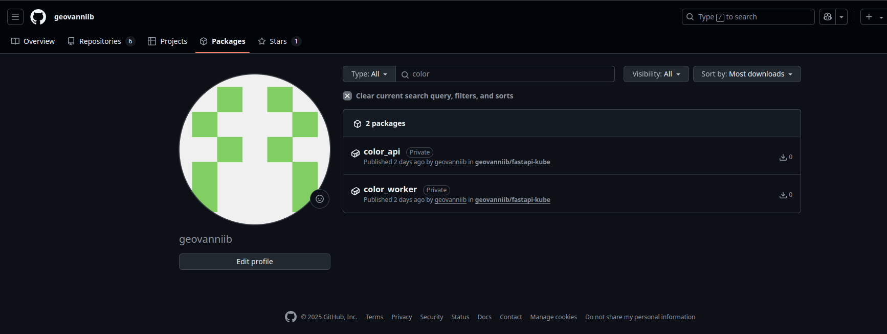
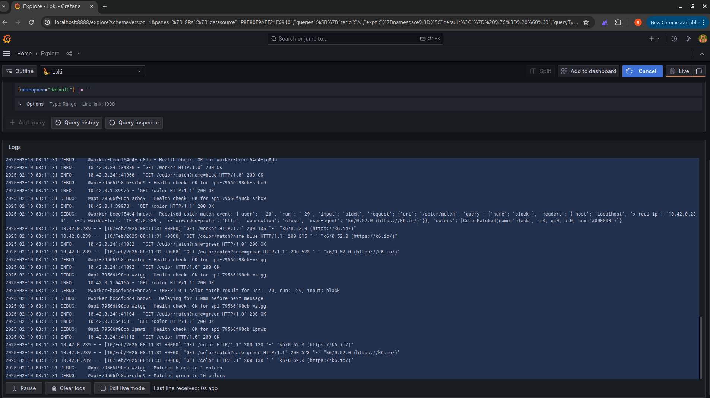
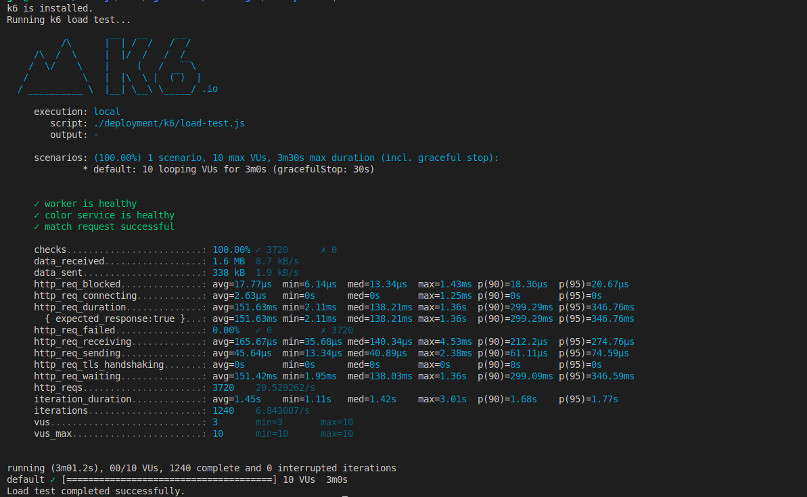
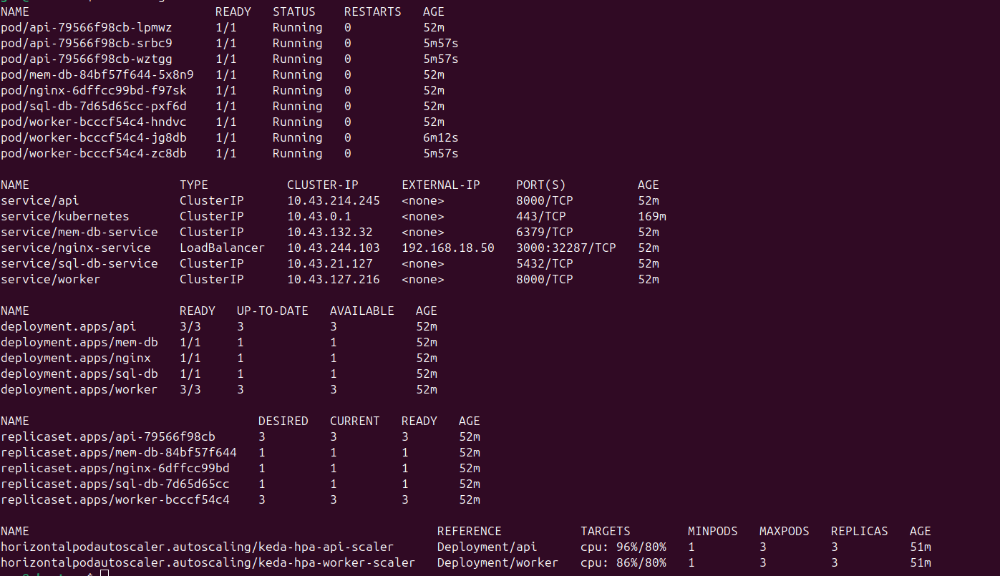

# Deployment in kubernetes of Python FastAPI with Nginx, Redis, & Postgres 


The default application will be hosted at (`http://localhost:3000/`) . while the Grafana UI will be at (`http://localhost:8888/login`)


## How to perform the deployment?

1. Configuring Permissions and Credentials

Collaborators of this project must create a classic access token on Github with write permissions on packages, with which they can publish to "ghcr.io/geovanniib/color_worker" and "ghcr.io/geovanniib/color_api", finally execute the bash script `tf-conf` filling in the console with the requested values ​​to configure the project with the local docker and k3s credentials.


2. Create the necessary images and publish them 

Using the `tf-setup` bash script the color_worker and color_api images will be published to github packages.




3. Deployment of the entire application 

First, using the default values ​​you should leave port 3000 and 8888 free so that there are no problems with the load balancers used. Then, using the bash script "tf-run" and the docker and k3s credentials already configured in step 1, everything required will be executed. For more detailed information read the deployment/README.md. Additionally, the Grafana password will appear in the console after the script has been executed. If for some reason the password does not appear, you would have to verify that the KUBECONFIG of the k3s is set as default in the current session.





4. Perform load testing

If k6 is installed, proceed to run the load testing with the help of the `tf-load` script to simulate how it behaves under load, in addition to its respective auto-scaling.






5. Clean the kubernetes cluster

Using the `tf-stop` bash script, the kubernetes resources will be deleted from the cluster leaving only the tf-state secrets


# Python FastAPI Template with Nginx, Redis, & Postgres


Fork this repository and use it as the base for a barebone Python [FastAPI](https://fastapi.tiangolo.com) application.  The architecture of this app is setup as follow:

```text
[Nginx] --> [Py:API] --pub--> [Redis:List] <--sub-- [Py:Worker] --save--> [Postgres:Table]
```

## Why does this exists?

- I needed a dummy python app to test [OpenTofu](https://opentofu.org) & [K3S](https://k3s.io) locally
- The `API` & `Worker` app are both designed to be injected with artifical bounded random thread sleep to simulate work
- This will allow the use of a load tester & [Kubernestes](https://kubernetes.io/docs/home/) horizontal auto scalers like [KEDA](https://keda.sh)
- It can also be used as [FastAPI](https://fastapi.tiangolo.com) micro service code template to quickly to setup an API & accompanying background worker service that's backed by [Redis](https://redis.io/docs/latest/develop/clients/redis-py/) & [Postgres](https://github.com/MagicStack/asyncpg) in a producer-consumer pattern

## API & Worker Design

Both uses FastAPI library. Each has their own `requirements.txt` and they both use `shared_lib` module (which also has its own requirement file).  You can find the container instruction under `./Dockerfile.api` & `./Dockerfile.worker` files.  Postgres SQL schema files can be foun under `./db` directory. Nginx configuration is stored in `./nginx.conf`

### API Endpoints

You can see these configured endpoints by going to `./api/main.py`

- `GET /` & `GET /color` - health check ping
- `GET /color/match?name={color_or_hex}` - `name` value could be: `light blue`, `yellow 8` or `fff` (white)
- `GET /color/names` - return all of the known [Open Color](https://yeun.github.io/open-color/) names

Currently, only `GET /color/match` endpoint triggers a write to Redis List named: `color_match_results` you can change the name of this list in `.env`

```env
REDIS_COLOR_LIST_NAME=color_match_results
```

API does not connect to Postgres.

### Worker Endpoints

Similar to the above API you can use `GET /` or `GET /worker` as health check ping.  These are the only endpoints.  Check them out in `./worker/main.py`

Worker subscribe to the same Redis List named: `color_match_results` as API. It also writes received messages from this Redis list into Postgres, into a table name `color_matches` in the `dev` schema.  You can see table structure in `./db/000_schema.sql`

#### Multi-threaded worker

By default, each worker will fork 2 threads for `color_consumer.py`. The value is configurable in `.env`. 

```env
WORKER_THREADS=2
```

The main thread is used to serve a simple API endpoint for container health check.  This can be expanded and used as an "internal" API also.

## Running the App for the First Time

Assuming you have `Docker` v27+ installed properly with `make` and you're on Linux or a variant of Unix (like MacOS). To build & run the whole thing, simply execute the following from repository root path:

```bash
# this will build all local containers & launch docker-compose.yml
# nginx by default will listen on your machine's `localhost:8000`
$ make run

# press Ctrl+C to stop. To truly shut down all containers, run:
$ make stop

# all data will be removed from Redis & Postgres container with the above command
```

`make run` only run the standard configuration from `docker-compose.yml` which should have only 1 instance of `API` & 1 instance of `Worker`.

To simulate a miniature cluster, instead do `make run-cluster`. This takes the following values from `.env` file to launch 2 instances of `API` and `Worker`. Both are stil proxied (and load balanced) via `nginx` on port `8000`.

```env
API_CLUSTER_SIZE=2
WORKER_CLUSTER_SIZE=2
```

`API` and `Worker` container ports are not exposed to your local workstation at all, only `nginx`, `redis` & `postgres` are (for debugging). You can do health check using `curl` directly on `nginx` to check `nginx` health & `API` + `Worker` health as follow:

```bash
# to check nginx
$ curl -iXGET 'http://localhost:8000'

HTTP/1.1 200 OK
Server: nginx/1.27.3
Date: Wed, 05 Feb 2025 04:56:46 GMT
Content-Type: text/plain
Content-Length: 45
Connection: keep-alive
Content-Type: application/json

{"message": "Load Balancer say: Hello! 👋"}

# to check API
$ curl -iXGET 'http://localhost:8000/color'

HTTP/1.1 200 OK
Server: nginx/1.27.3
Date: Wed, 05 Feb 2025 04:57:06 GMT
Content-Type: application/json
Content-Length: 117
Connection: keep-alive

{"status":"OK","name":"color api 🎨","host":"ac95b94d48f3","boot":"2025-02-05T04:25:47.473431","alive":"0:31:19.263662"}

# to check Worker
$ curl -iXGET 'http://localhost:8000/worker'
```

If you're launching a cluster using `make run-cluster`, doing repeated health check on `API` or `Worker` will yield different `host` id, proving that `nginx` load balancer configuration is working as expected.

### Quick Tests

I added these make commands to help with testing. **NOTE** that all of these tests are basically using `curl` against `localhost:${LOAD_BALANCER_PORT}`.  You can find this value in `.env` file.

```bash
## pinging & health check:

# check load balancer health
$ make check-nginx
# check API health
$ make check-api
# check worker health
$ make check-worker

## testing application by sending query to the color API

# color api match: light blue
$ make test-color-match
# color api match: green
$ make test-color-match2
# reverse api hex match: ffffff
$ make test-hex-match
# short api hex match: fff
$ make test-hex-match2
# get all Open Color base names
$ make test-color-names
# send in a bad input to get a 400 by trying to match the color name: "er"
$ make test-color-error
```

### Load Testing

Artifical thread sleep can be injected into both the `API` & the `Worker` app to simulate heavy work.  Both of these values can be changed in `.env` (along with the cluster size)

```env
# artifical delay settings. 
# Upper & lower bound can be the same value. Setting both to 0 disables delay.

API_DELAY_MIN=100
API_DELAY_MAX=150

WORKER_DELAY_MIN=100
WORKER_DELAY_MAX=150

# you can also change the cluster size for: make run-cluster

API_CLUSTER_SIZE=2
WORKER_CLUSTER_SIZE=2
```

## Debugging

VisualStudio Code configuration are checked in for easy debugging without any setup. This author assumes you're using Linux or some variation of Unix (MacOS).  Debugging might not work on Windows unless you're using Linux sub-system.

### Local Workstation Debug via Python Virtual Environment

To do this, you'll need the following installed:

- Python v3.10+ - Containers are setup to use Python version v3.13
- Python Pip (package manager) module
- Python Venv (virtual environment) module
- VisualStudio Code &
- these recommended (but optional) extensions:
  - `Python` - by Microsoft
  - `Python Debugger` - also by Microsoft
  - `autopep8` - also by Microsoft
  - `Back Formatter` - you guest it, Microsoft
  - `Flake8` - Microsoft
  - `Gather` - Microsoft
  - `isort` - Microsoft
  - `Mypy Type Checker` - Microsoft
  - `CMake Tools` - Microsoft
  - `Makefile Tools` - Microsoft
  - `Docker` - Microsoft
  - `YAML` - Not Microsoft: Red Hat 😅

This is the simplest setup. To start, change directory to project root in your shell, then:

```bash
# first, launch the database containers alone (Redis & Postgres) using:
# they will be running & available on port 16379 & 15432 respectively on your local host
# there's no password for Redis, Postgres credential can be found in docker-compose.yml file in the `sql_db` environment section
$ make run-db 

# after that, do the initial setup if you haven't done it already. 
# It will create an virtual environment with all depdencies installed at ./.venv.
$ python3 -m venv .venv
$ source .venv/bin/activate
# now install all packages
$ pip3 install -r shared_lib/requirements.txt
$ pip3 install -r api/requirements.txt
$ pip3 install -r worker/requirements.txt
# you only need to do these above steps once

# if you're not running the above, active your virtual environment
$ source .venv/bin/active

# assuming you have vscode console command setup as "code", launch it in the activated shell
$ code .
```

Within Visual Studio Code, locate your debugger tab (on the left column, looks like a Play button).
Now select one of the following `DEBUG AND RUN` profile & launch it. These profiles are configured in `.vscode/launch.json` as:

- `Debug: Local API` - this will launch the API and serve the app from port `3000`
- `Debug: Local Worker` - this will launch worker and serve the app from port `3001`

**Note** that

- the above 2 debug profiles will need Redis & Postgres running or they will fail (API only needs Redis).  These profiles are designed to work with the exposed database ports mentioned above
- Hot re-loading (live code editting) while debugging is only supported with local debugger. Container based debugging is not yet setup for live hot reloading.

### Container attach Debug via Python Remote Debugger

Since the code is running on Alpine Linux (not a typical distro for desktop use). Sometimes it's still best to debug & test the code within the container and observe its behavior within the actual OS being used in actual deployment.

Debugging assumes you have Visual Studio Code setup with all above plugins mentioned.  From your console, launch containers in debug mode by executing:

```bash
# this will launch 1 instance of API & Worker (configured with 1 thread only) for easy debugging
# this run combines docker-compose.yml with docker-compose.debug.yml (see Makefile)
# it will expose an additional debuging port of 4000 (API) & 4001 (worker) for debugpy to attach to
$ make debug

# activate virtual environment (created above) if you haven't already done so
$ source .venv/bin/activate

# you can now launch vs-code from the same folder root
$ code .
```

Within Visual Studio Code, locate your debugger tab (on the left column, looks like a Play button).
Now select one of the following `DEBUG AND RUN` profile & launch it:

- `Attach: Docker API` - will connect vs code to the running API container
- `Attach: Docker Worker` - will conenct vs code to the running worker container

You can now attach a debugger break point on the health check endpoint located in `api/main.py` (or `worker/main.py`; search for `@app.get("/")`).  Make a simple API request via curl: `curl 'localhost:8000/color'`.  Your vs code deugger should pause on your break point. Both containers can be attached to at once!

Local `./api`, `./worker`, & `./shared_lib` is mounted in the launched docker containers. Changes made locally via VsCode or directly within the container will modify the same files (locally).  If you need to install `ipdb`, you can do so by uncommenting the line in `./debug_requirements.txt`

**NOTE:**

- `make debug` by default does not pause the container and wait for a debugger to be attached.  If you need this behavior, simply edit `.env` file and toggle the following env vars for the appropriate container.
- Runing in container debug mode will also persists Redis & Postgres data. In all other mode all database data are not kept on container exit with `make stop`


```env
# set value to 1 if you want these container to wait for an attach debugger before starting via: make debug
API_DEBUG_PAUSE=0
WORKER_DEBUG_PAUSE=0
```

Happy Debugging 👾 🎉
